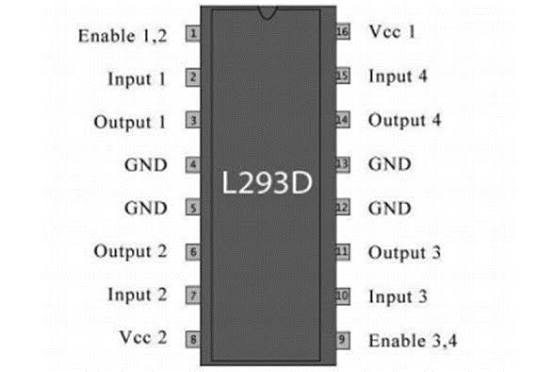

# Line-Follower-CNN
A deep learning and OpenCV-based line follower robot using a webcam and Arduino for real-time line detection and autonomous movement.

---

## List of Content

- [Introduction](#Introduction)
- [Literature](#Literature)
- [Design of Hardware and Software](#Design-of-Hardware-and-Software)
- [Result](#Result)

---

## Introduction

A line follower robot is an autonomous robot designed to follow a predefined path or line. To achieve this, the robot needs to detect the position of the line and determine the appropriate movement based on the visual information.

In this project, a deep learning and OpenCV-based line follower robot is developed using a webcam, Arduino Uno, and L293D motor driver. The webcam captures images of the track, while OpenCV is used to process the captured images before they are passed to a deep learning model.

The deep learning model is trained to recognize the line direction and classify the robot's movement into three actions: Forward, Left, and Right. The predicted action is then sent from the Python program to the Arduino through serial communication.

The main goal of this project is to explore the integration of computer vision, deep learning, and embedded systems to create an autonomous robot capable of following a track based on visual information.

---

## Literature

### Deep Learning

  

Deep Learning is a subfield of machine learning that uses artificial neural networks with multiple layers to learn and recognize patterns from data. It is particularly useful for processing complex data such as images, videos, and other visual information.

In this project, deep learning is used to learn the visual patterns of the line track from camera images. The trained model classifies the input image into three movement categories: Forward, Left, and Right. The classification result is then used to determine the movement of the line follower robot.

### Convolutional Neural Network (CNN)

  

Convolutional Neural Network (CNN) is a type of deep learning architecture commonly used for image and visual data processing. CNN is designed to automatically learn important features from images through layers such as convolution and pooling.

In this project, CNN is used to learn visual patterns from images captured by the webcam and recognize the position or direction of the line. The extracted visual features are then used to classify the robot's movement into three categories: Forward, Left, and Right.

### OpenCV

  

OpenCV (Open Source Computer Vision Library) is an open-source library used for image processing and computer vision. It provides tools for capturing, processing, and analyzing images or video, making it useful for real-time visual applications.

In this project, OpenCV is used to capture images from the webcam and prepare the visual input for the deep learning model. The processed images are then classified by the CNN model to determine the robot's movement, such as Forward, Left, or Right. The project specifically combines OpenCV with deep learning for automatic line detection and robot control.

### Arduino UNO

  

Arduino Uno is a microcontroller board based on the ATmega328P and is commonly used for embedded systems and robotics applications.

In this project, Arduino Uno acts as the motor control unit. It receives movement commands from the Python program through serial communication. The commands generated by the deep learning model are classified into three actions: Forward (F), Left (L), and Right (R). Arduino then processes these commands and sends control signals to the L293D motor driver to control the robot's movement.

### L293D

  

L293D is a dual H-bridge motor driver IC used to control DC motors. It acts as an interface between the Arduino Uno and the motors, allowing the microcontroller to control the direction of motor rotation.

In this project, the L293D receives control signals from the Arduino Uno based on the movement command generated by the deep learning model. It then controls the DC motors so the robot can move forward, turn left, or turn right.

---

## Design

The system is divided into two main parts: **hardware design** and
**software design**. The hardware is responsible for capturing the
environment and controlling the robot's movement, while the software
handles image processing, deep learning, and movement classification.

### Hardware Design

  

The hardware consists of a **webcam, Arduino Uno, L293D motor driver,
DC motors, power supply, and the robot chassis**.

The webcam is mounted perpendicular to the floor so that it can capture
the line track. The Arduino Uno is connected to the computer through a
serial cable and is responsible for executing the movement commands
received from the Python program. :contentReference[oaicite:0]{index=0}

The main hardware components are:

| Component | Function |
|:---|:---|
| 📷 **Webcam** | Captures the line track |
| 🔵 **Arduino Uno** | Controls the robot's movement |
| ⚙️ **L293D** | Drives the DC motors |
| 🔄 **DC Gear Motors** | Moves the robot |
| 🛞 **Wheels** | Provides robot movement |
| ⚪ **Caster Wheel** | Supports the robot |
| 🔋 **Powerbank** | Provides power for the system |
| 🔌 **Jumper Wires** | Connects the electronic components |
| 🧱 **Acrylic Robot Chassis** | Supports the mechanical components |

### Software Design

The software system is developed using **Python, OpenCV, and a deep
learning model**.

The webcam captures images of the line track, which are then processed
using OpenCV. The processed images are used as input for the trained
deep learning model to identify the appropriate movement of the robot.

The system classifies the line condition into three movement commands:

## Programs

## Programs

The program is divided into **four main parts**: **data collection,
data training, testing, and Arduino control**. Each program has a
different role in developing and operating the line follower robot.

## Result

### Forward Condition

  

### Left Condition

  

### Right Condition

  

